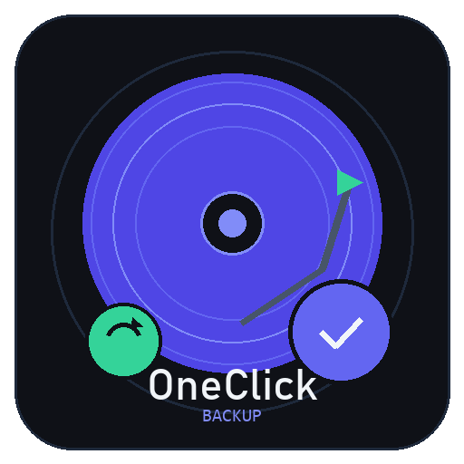

<p align="center">
  
</p>

<h1 align="center">OneClick Backup & Disk Manager</h1>

<p align="center">
  <strong>A modern, all-in-one Windows disk management and backup utility.</strong><br>
  Built with Python &amp; CustomTkinter — dark-themed, multi-language, admin-aware.
</p>

<p align="center">
  
  
  
  
</p>

---

## Overview

**OneClick Backup** provides a professional desktop interface for managing disks, partitions, backups, and system cloning on Windows. It combines the power of Windows management tools (diskpart, PowerShell, WMI, wbadmin, robocopy) behind an intuitive dark-themed GUI.

### Key Highlights

- **Dashboard** with real-time disk visualization (gradient partition bars, health status, SMART data)
- **Disk Cloning** — full disk clone or OS-only migration to SSD/HDD
- **Partition Management** — create, resize, merge, format, delete, change drive letters
- **Backup & Restore** — full disk images, partition backups, system state backups with checksums
- **Disk Conversion** — MBR ↔ GPT, Basic ↔ Dynamic, NTFS ↔ FAT32
- **Partition Recovery** — scan and recover lost/deleted partitions
- **Advanced Tools** — WinPE bootable USB creation, 4K alignment check, disk health reports
- **6 Languages** — English, French, Spanish, German, Arabic (RTL), Chinese Simplified
- **UAC-aware** — works in limited mode, with optional admin elevation for full access

---

## Screenshots

The application features a "Midnight Operations" dark theme with an indigo/teal accent palette, gradient-rendered disk bars, accent-striped cards, and a three-font typographic system (Bahnschrift, Consolas, Segoe UI).

---

## Quick Start

### Option A — Run from Source

```bash
# 1. Clone the repository
git clone https://github.com/YOUR_USERNAME/OneClickBackup.git
cd OneClickBackup

# 2. Install dependencies
pip install -r requirements.txt

# 3. Launch
python main.py
```

Or double-click **`launch.bat`** — it handles dependency installation, admin elevation, and launches the app automatically.

### Option B — Standalone Executable

Download `OneClickBackup.exe` from the [Releases](../../releases) page — no Python installation required.

### Option C — Build the EXE Yourself

```bash
python build.py           # Release build (no console)
python build.py --debug   # Debug build (with console window)
```

Output: `dist/OneClickBackup.exe`

---

## Requirements

| Dependency       | Version  | Purpose                          |
|:-----------------|:---------|:---------------------------------|
| Python           | ≥ 3.10   | Runtime                          |
| customtkinter    | ≥ 5.2.0  | Modern dark-themed UI framework  |
| psutil           | ≥ 5.9.0  | Disk usage & system metrics      |
| wmi              | ≥ 1.5.1  | Windows Management Instrumentation|
| pywin32          | ≥ 306    | Windows COM/API bindings         |
| Pillow           | ≥ 10.0.0 | Logo/icon generation             |

Install all at once:

```bash
pip install -r requirements.txt
```

---

## Project Structure

```
OneClickBackup/
├── main.py                   # Entry point
├── launch.bat                # Windows launcher (auto-install + admin elevation)
├── install.bat               # Dependency installer
├── build.py                  # PyInstaller build script
├── generate_logo.py          # Logo & icon generator (Pillow)
├── requirements.txt          # Python dependencies
│
├── assets/
│   ├── logo.png              # 512x512 application logo
│   └── icon.ico              # Multi-size Windows icon (16–256px)
│
└── src/
    ├── core/
    │   ├── disk_info.py      # WMI/PowerShell disk & partition scanning
    │   ├── operations.py     # Queued disk operations (preview-before-apply)
    │   └── backup.py         # Backup, restore, clone, WinPE creation
    │
    ├── ui/
    │   ├── app.py            # Main window, sidebar navigation, status bar
    │   ├── dashboard.py      # Dashboard page (disk overview, partition detail)
    │   ├── pages.py          # Feature pages (clone, partitions, backup, etc.)
    │   └── widgets.py        # Shared widgets, color palette, styling helpers
    │
    └── utils/
        ├── admin.py          # UAC elevation & admin privilege checks
        ├── helpers.py        # diskpart/PowerShell wrappers, formatting utils
        └── i18n.py           # Translation system (6 languages)
```

---

## Architecture

### Design Patterns

- **Preview-before-apply** — Disk operations are queued, reviewed, then batch-executed. No destructive action happens without explicit confirmation.
- **Lazy page loading** — Feature pages are instantiated on first navigation to reduce startup time.
- **Batched system queries** — WMI/PowerShell calls are grouped (3 calls for all disks instead of N×4 per disk) for performance.
- **Cache with TTL** — Disk scan results are cached for 5 seconds to avoid redundant I/O.
- **Graceful degradation** — Admin features are disabled (not hidden) when running without privileges.

### Core Modules

| Module              | Responsibility                                                    |
|:--------------------|:------------------------------------------------------------------|
| `disk_info.py`      | Scans physical disks via WMI + PowerShell fallback. Returns `DiskInfo` / `PartitionInfo` dataclasses with size, health, filesystem, alignment data. |
| `operations.py`     | Queue-based operation manager. Validates inputs, prevents same-disk cloning, sanitizes labels. Executes via diskpart scripts and PowerShell. |
| `backup.py`         | Full backup lifecycle: create images, verify checksums, restore, clone partitions, create WinPE bootable media. Uses robocopy, wbadmin, diskpart. |

### UI Layer

| Module              | Responsibility                                                    |
|:--------------------|:------------------------------------------------------------------|
| `app.py`            | Root `CTk` window. Sidebar with navigation, language selector, admin status, version label. Page management with lazy creation. |
| `dashboard.py`      | Real-time disk overview. Canvas-rendered gradient partition bars, disk cards with accent stripes, partition detail panel with filesystem-colored headers. |
| `pages.py`          | Six feature pages (Clone, Partitions, Backup, Convert, Recovery, Advanced). Each receives appropriate managers via dependency injection. |
| `widgets.py`        | Foundation layer. Defines the `COLORS` palette, `_lighten()`/`_darken()` color helpers, `_canvas_rounded_rect()`, and all shared widgets. |

---

## Internationalization

The app supports **6 languages** with instant hot-switching (no restart required):

| Code | Language              | Direction |
|:-----|:----------------------|:----------|
| `en` | English               | LTR       |
| `fr` | Français              | LTR       |
| `es` | Español               | LTR       |
| `de` | Deutsch               | LTR       |
| `ar` | العربية               | RTL       |
| `zh` | 中文 (Simplified)     | LTR       |

Language preference is stored in `~/.oneclickbackup_lang.json` and persists across sessions. Arabic layout automatically switches to right-to-left alignment.

---

## Administrator Privileges

Many disk operations require elevated privileges. The app works in two modes:

| Mode         | Available Features                                                       |
|:-------------|:-------------------------------------------------------------------------|
| **Limited**  | Dashboard viewing, disk info reading, backup browsing                    |
| **Admin**    | All operations: clone, partition management, backup/restore, conversion  |

The sidebar shows the current privilege level. Click **"Run as Admin"** to elevate via UAC without restarting the app manually.

---

## Building the Executable

The `build.py` script wraps PyInstaller with the correct configuration:

```bash
python build.py
```

This will:
1. Verify PyInstaller is installed (auto-installs if missing)
2. Check for the icon file (auto-generates if missing)
3. Clean previous build artifacts
4. Bundle everything into a single `dist/OneClickBackup.exe`

The EXE includes all dependencies, assets, and translations — no Python installation needed on the target machine.

### Build Options

| Flag       | Effect                                |
|:-----------|:--------------------------------------|
| *(none)*   | Release build — no console window     |
| `--debug`  | Debug build — console window visible  |

---

## Security Considerations

- All diskpart commands use **parameterized scripts** written to temp files (no shell injection)
- Volume labels are **sanitized** with a strict regex (`^[A-Za-z0-9 _\-]{0,32}$`)
- Operations use a **queue-then-apply** pattern — nothing destructive happens without explicit user confirmation
- Admin elevation uses Windows UAC (`ShellExecuteW` with `runas` verb)
- No network access — the application runs entirely offline

---

## Contributing

1. Fork the repository
2. Create a feature branch (`git checkout -b feature/amazing-feature`)
3. Commit your changes (`git commit -m 'Add amazing feature'`)
4. Push to the branch (`git push origin feature/amazing-feature`)
5. Open a Pull Request

---

## License

This project is licensed under the MIT License. See [LICENSE](LICENSE) for details.

---

<p align="center">
  <sub>Built with Python, CustomTkinter, and a lot of ☕</sub>
</p>
